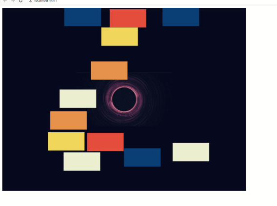

# Matter.js Galaxy Simulation

Welcome to our Matter.js galaxy simulation project! Our project is a playful interactive simulation of a galaxy where you can interact with planets (rectangles) revolving around a black hole (circle). 

The planets can be dragged around the space, and they'll stay where you leave them, still tethered to the black hole by an invisible force (line).

Check out the galaxy simulation in action:



## Development Journey

The development of this simulation was an exciting journey, full of challenges and learnings. Here are some of the key steps and hurdles we faced:

- We first started with Matter.js and created a simple simulation with rectangles that had gravity. They could be added into the scene with a button click and could be dragged around.

- A crucial requirement was to fix the rectangles in their position and not be affected by gravity. This was achieved by setting the `isStatic` property of the rectangles to `true`.

- The rectangles were then tethered to a circle in the center, representing a black hole. This was accomplished using the `Constraint.create()` function in Matter.js.

- We then wanted to make sure that when a rectangle is dragged and then released, it remains in its new position. To achieve this, we had to modify the `mouseConstraint` and update the `pointA` of each constraint whenever a rectangle was dragged.

- There was also a requirement to make the rectangles not pass the borders of the screen. To handle this, we added four static rectangular bodies around the edges of the canvas to act as walls.

- One of the cool features we added was a galaxy image inside the central circle. To achieve this, we had to tackle several challenges like loading the image before using it, disabling wireframes in the render options, and properly scaling the image.

- Finally, to prevent the rectangles from rotating while dragging, we set their `inertia` property to `Infinity`.

## Development Setup

To run the project locally, follow these steps:

1. Clone the repository to your local machine.
2. Install the dependencies using `npm install`.
3. Start the development server by running `npm run start`.

Now, you can open your browser and navigate to `http://localhost:9061` to see the simulation in action!

## Build and Deploy

When you're ready to deploy the simulation, run the following command to create the necessary build assets:

```bash
npm run build
```

This command generates a `dist` folder containing the compiled JavaScript and other assets ready for deployment.

We hope you enjoy interacting with our Matter.js galaxy simulation. Happy coding!